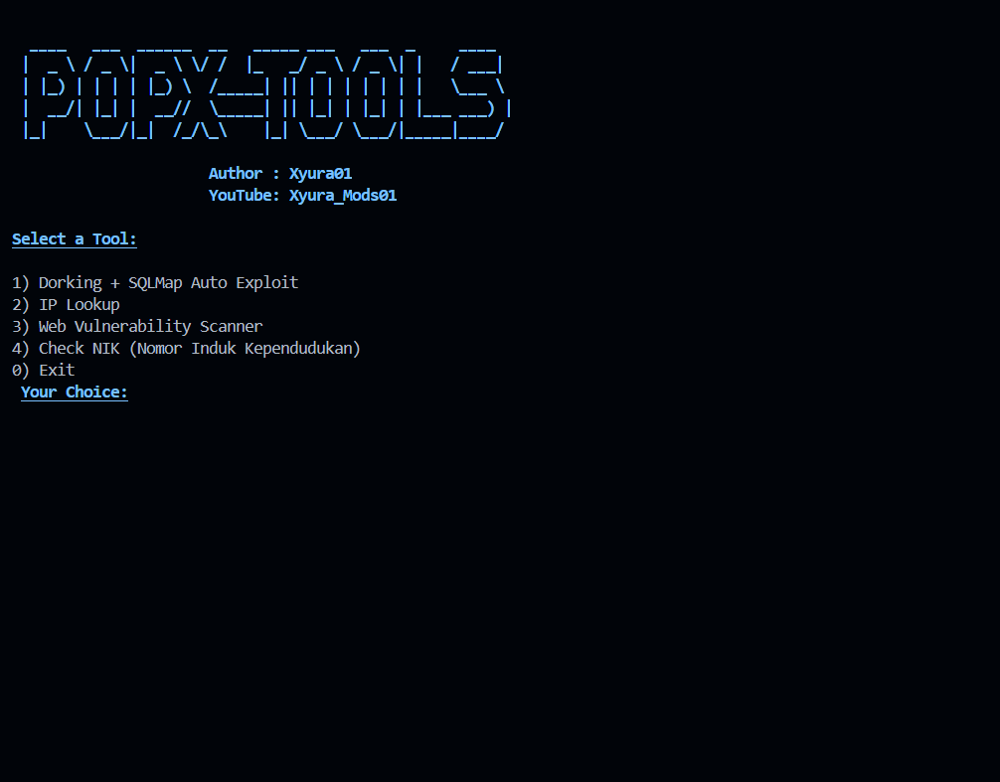

# POPX-TOOLS


## Instalations
```
$ pkg install git python
$ git clone https://github.com/Xyuraa/POPX-TOOLS
$ cd POPX-TOOLS
$ pip install -r requirements.txt
$ python POPX.py
```

## Get in Touch
- [Youtube](https://youtube.com/@xyura_mods01?si=zdlj1znvKh-XP1Ax)
- [Instagram](https://instagram.com/xyura011)
